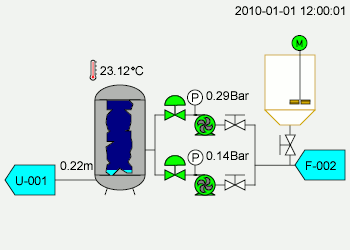
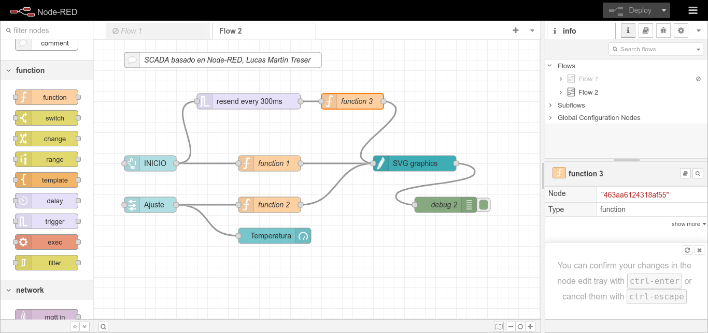
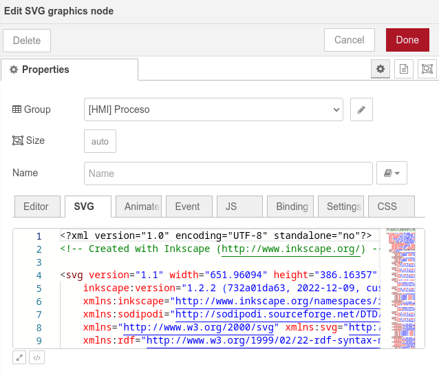

# SCADA-like con Node-RED

Sistema experimental simil SCADA con [Node-RED](https://nodered.org/) y manipulación de gráficos vectoriales (SVG). Este proyecto está basado en el trabajo *Tutorial SVG Node (SCADA-Like) Machine Monitoring System Node-Red* de [Yaser Ali Husen](https://www.lean-tool.com).

SCADA, acrónimo de Supervisory Control And Data Acquisition (Control Supervisor y Adquisición de Datos) es un concepto que se emplea para realizar un software para ordenadores que permite controlar y supervisar procesos industriales a distancia. Facilita retroalimentación en tiempo real con los dispositivos de campo (sensores y actuadores), y controla el proceso automáticamente. Provee de toda la información que se genera en el proceso productivo (supervisión, control calidad, control de producción, almacenamiento de datos, etc.) y permite su gestión e intervención. [Wikipedia](https://es.wikipedia.org/wiki/SCADA).


*Simulación típica de un SCADA para una planta de proceso, basado en un [diagrama de tuberías e instrumentación](https://es.wikipedia.org/wiki/Diagrama_de_tuber%C3%ADas_e_instrumentaci%C3%B3n).*

## Implementación con Node-RED

Con Node-RED se puede diseñar la lógica de control del sistema mediante el uso de diferentes widgets, y de eventos que disparen las animaciones del dashboard. Respecto a las diferentes animaciones, se utilizó el nodo [*node-red-contrib-ui-svg*](https://flows.nodered.org/node/node-red-contrib-ui-svg) que permite interactuar con gráficos vectoriales SVG en el dashboard.

Los gráficos vectoriales escalables o gráficos vectoriales redimensionables (del inglés: Scalable Vector Graphics (SVG)) es un formato de gráficos vectoriales bidimensionales, tanto estáticos como animados, en formato de lenguaje de marcado extensible XML (Extensible Markup Language), es decir que se compone por código y cuya especificación es un estándar abierto desarrollado por el W3C desde 1999. A diferencia de aquellos gráficos codificados en webP, JPG, PNG, o TIFF (Rasters), los SVG pueden ser interactivos y dinámicos y esto se debe a que no se componen por mapa de bits, sino que están compuestos por vectores, que son instrucciones matemáticas que se le dan al navegador o programas de ediciones de estos gráficos vectoriales, para escalarlos de manera infinita y sin perder resolución o calidad en el gráfico. [Wikipedia](https://es.m.wikipedia.org/wiki/Gr%C3%A1ficos_vectoriales_escalables).

La estructura básica de un archivo SVG es la siguiente:

```xml
<svg viewBox="0 0 20 20" xmlns="http://www.w3.org/2000/svg" >
    <title>Estructura basica del SVG</title>
    <style>
        .circle {fill: blue}
    </style>
    <circle class="circle" cx="5" cy="5" r="5" />
</svg>
```

Mediante diferentes funciones javascripts, implementadas utilizando el nodo `function`, es posible alterar el contenido del gráfico SVG que se despliega en el dashboard del sistema. 



El nodo que recibe los mensajes de las distintas funciones y se encarga de alterar el SVG es `SVG graphics`. En el *tab* **SVG** se carga el código del gráfico a utilizar. 



La idea es alterar el contenido de diferentes variables, y luego inyectarlas en el SVG para reemplazar propiedades de alguna parte del gráfico, por ejemplo el contenido de una etiqueta de texto, el color de una línea, etc. A continuación un ejemplo de la implementación:

```javascript
var color_change;
var text_change;

//set global variable for start/stop
var toogle = context.get('toogle') || "false";

if (toogle == true){
    toogle = false;
    color_change = "#ff0000";
    text_change = "STOP";
}
else {
    toogle = true;
    color_change = "#00ff00";
    text_change = "START";
}
context.set('toogle', toogle);

msg.payload = [
    {
        "command": "set_style",
        "selector": "#path3951",
        "attributeName": "fill",
        "attributeValue": color_change
    },
    {
        "command": "update_text",
        "selector": "#tspan2836-7",
        "textContent": text_change
    }
];

return msg;
```

## RECURSOS

- [Node Red: Machine Monitoring System SCADA-Like](https://www.youtube.com/watch?v=8d3fbDEnuFo)
- [Creating SCADA-Like User Interfaces For Node-RED](https://ricolsen1supervc.wordpress.com/2019/09/29/creating-scada-like-user-interfaces-for-node-red/)
- [Open Source HTML5 Synoptic Toolkit](https://scadavis.io)
- [A Node-RED node to host a local DrawSvg service](https://flows.nodered.org/node/node-red-contrib-drawsvg)
- [A Node-RED widget node to show interactive SVG (vector graphics) in the dashboard](https://flows.nodered.org/node/node-red-contrib-ui-svg)
- [Easily create data-driven web UI's for Node-RED using any (or no) front-end library](https://flows.nodered.org/node/node-red-contrib-uibuilder)

## Licencia

Tanto el trabajo original de *Yaser Ali Husen*, como el archivo SVG [*Krupp-Renn process diagram.svg*](https://commons.wikimedia.org/wiki/File:Krupp-Renn_Process_diagram.svg) están protegidos por sus respectivas licencias. El resto del trabajo está protegido por la **Licencia MIT**. Puedes acceder a la versión original de la licencia (en inglés) a través del archivo [LICENSE](./LICENSE) o en línea en [The MIT License (MIT)](https://mit-license.org/). También proporcionamos una traducción no oficial desde [Wikipedia](https://es.m.wikipedia.org/wiki/Licencia_MIT#La_licencia):

Copyright (c) 2024 Lucas Martín Treser

Por la presente se concede permiso, libre de cargos, a cualquier persona que obtenga una copia de este software y de los archivos de documentación asociados (el "Software"), a utilizar el Software sin restricción, incluyendo sin limitación los derechos a usar, copiar, modificar, fusionar, publicar, distribuir, sublicenciar, y/o vender copias del Software, y a permitir a las personas a las que se les proporcione el Software a hacer lo mismo, sujeto a las siguientes condiciones:

El aviso de copyright anterior y este aviso de permiso se incluirán en todas las copias o partes sustanciales del Software.

EL SOFTWARE SE PROPORCIONA "COMO ESTÁ", SIN GARANTÍA DE NINGÚN TIPO, EXPRESA O IMPLÍCITA, INCLUYENDO PERO NO LIMITADO A GARANTÍAS DE COMERCIALIZACIÓN, IDONEIDAD PARA UN PROPÓSITO PARTICULAR E INCUMPLIMIENTO. EN NINGÚN CASO LOS AUTORES O PROPIETARIOS DE LOS DERECHOS DE AUTOR SERÁN RESPONSABLES DE NINGUNA RECLAMACIÓN, DAÑOS U OTRAS RESPONSABILIDADES, YA SEA EN UNA ACCIÓN DE CONTRATO, AGRAVIO O CUALQUIER OTRO MOTIVO, DERIVADAS DE, FUERA DE O EN CONEXIÓN CON EL SOFTWARE O SU USO U OTRO TIPO DE ACCIONES EN EL SOFTWARE.